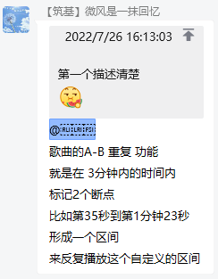

:::tip
此页面收集的是用户的反馈，开发者做不做俺也不鸡道

以下的实现方法均为本人猜测，实际实现方法未知 ~~（我都不知道开发者做不做~~

某痕快来看!!!! @落雪無痕
:::

# 附录
[落雪無痕](https://github.com/lyswhut/)在2022年7月27日回复(如下图)

 
 
 

[落雪無痕](https://github.com/lyswhut/)在2022年8月7日回复(如下图)

 
 
 
 

落雪無痕加油哇！

# **已有功能**

**查看播放列表**
- 允许查看当前播放的列表 ~~（有时候有许多歌都点了下一首播放，却想调整一下顺序）~~
- 使用方法：见Github
- Github:
  - lx-music-desktop: [https://github.com/lyswhut/lx-music-desktop/issues/837](https://github.com/lyswhut/lx-music-desktop/issues/837)
  - lx-music-mobile: [https://github.com/lyswhut/lx-music-mobile/issues/133](https://github.com/lyswhut/lx-music-mobile/issues/133)

# **“以后”会有的功能**

**播放本地文件**
- 允许播放已经下载在本地的音乐（mp3，flac）
- 实现方法：我不到啊 ~~（可以用ffmpeg？~~
- GitHub:
  - lx-music-desktop: [https://github.com/lyswhut/lx-music-desktop/issues/904](https://github.com/lyswhut/lx-music-desktop/issues/904)
  > 作者回复：可能在以后的某个版本添加
  - lx-music-mobile: [https://github.com/lyswhut/lx-music-mobile/issues/64](https://github.com/lyswhut/lx-music-mobile/issues/64)

**自定义主题**
- 电脑端和手机端都可以自定义主题，例如自定义背景图片，自定义主题颜色（可以用HEX）    ~~移动端甚至可以自定义启动图或图标~~
- 实现方法：~~可以把主题包（包含主题色，背景图片等）打包成theme文件，在主题后面新增一个自定义主题管理？~~ @落雪無痕，记得重构主题功能！！！
- GitHub:
  - lx-music-desktop: [https://github.com/lyswhut/lx-music-desktop/issues/256](https://github.com/lyswhut/lx-music-desktop/issues/256)
  > 作者回复：遗憾的是，目前软件的主题架构不支持自定义字体颜色，软件内置的主题是编译代码时生成的，无法做到由用户自定义软件内的主题色，以后若重构主题功能再考虑自定义皮肤
  - lx-music-mobile: 暂无issue

# **“强烈建议”加上的功能**

## lx-music-mobile

**黑暗模式下主题色仍然生效**
- 在黑暗模式下，部分主题色不生效，希望主题色全局（或在合适的地方）生效 
- 实现方法：~~将所有原本是主题色的文字等，不进行大的变动~~ 看开发者怎么做
- Github:
  - lx-music-mobile: 暂无issue

**悬浮窗多行歌词**（已经有不下于10次的反馈啦！
- 悬浮窗歌词可以有多行歌词，类似于电脑端的桌面歌词一样
- 实现方法：~~开一个和歌词页一样的透明窗口？~~ 不知道哇
- GitHub:
  - lx-music-mobile: 暂无issue

**通过歌词调整进度**
- 可以像PC端一样，通过滑动歌词进行调整进度 ~~（可以加一个开关~~
- 实现方法：获取当前歌词对应的歌曲时间，再跳转到对应歌曲时间的位置播放
- Github:
  - lx-music-mobile: [https://github.com/lyswhut/lx-music-mobile/issues/121](https://github.com/lyswhut/lx-music-mobile/issues/121)

## lx-music-desktop

**电脑间同步歌单**
- 电脑之间能在局域网同步歌单 
- 实现方法：~~将其中一台电脑当成手机端进行同步？~~ 见issue
- GitHub:
  - lx-music-desktop: [https://github.com/lyswhut/lx-music-desktop/issues/924](https://github.com/lyswhut/lx-music-desktop/issues/924)

## lx-music-mobile & lx-music-desktop

**搜索歌单/专辑**
- 增加一个搜索各大平台歌单/专辑的功能
- 实现方法：调用官方API
- Github:
  - lx-music-mobile: [https://github.com/lyswhut/lx-music-mobile/issues/135](https://github.com/lyswhut/lx-music-mobile/issues/135)
  - lx-music-desktop: [https://github.com/lyswhut/lx-music-desktop/issues/246](https://github.com/lyswhut/lx-music-desktop/issues/246)
  > 作者回复：专辑搜索暂不打算添加，以后看情况

# **~~好像没什么用的功能~~ 不知道能不能加上的功能**

## lx-music-mobile

**车载歌词**（好像也蛮多人反馈的
- 增加车载歌词功能
- 实现方法：可以把歌名和歌手放在原本显示歌手的地方，原本显示歌名的地方放上一句歌词，歌词刷新时就刷新歌名，相当于切了一首歌
- Github:
  - lx-music-mobile: [https://github.com/lyswhut/lx-music-mobile/issues/103](https://github.com/lyswhut/lx-music-mobile/issues/103)
  > 作者回复：说实话我不懂怎么加，这个涉及安装原生代码，需要修改播放模块

## lx-music-mobile & lx-music-desktop

**倍速播放**
- 增加倍速播放功能 ~~有点鸡肋，而且开发者好像不愿意做，不知道现在想不想做~~
- 实现方法：未知
- Github:
  - lx-music-mobile: 暂无issue
  - lx-music-desktop: [https://github.com/lyswhut/lx-music-desktop/issues/13](https://github.com/lyswhut/lx-music-desktop/issues/13)
  > 作者回复：个人不推荐使用本软件作为常用播放器使用，本软件是为了查找歌曲 可以用其他播放器播放

**同步时二次确认**
- 在移动/电脑端同步时弹出选项选择是否同步并有开关选择是否弹出此窗口 
- 实现方法：在连接时弹出窗口，是否与某某电脑/手机同步歌单
- Github:
  - lx-music-mobile: 暂无issue
  - lx-music-desktop: 暂无issue

**音效**
- 更改音效，允许自定义/导入不同的音效（作者没有精力去做了
- 实现方法：未知
- Github:
  - lx-music-mobile: [https://github.com/lyswhut/lx-music-mobile/issues/19](https://github.com/lyswhut/lx-music-mobile/issues/19)
  > 作者回复：目前不考虑添加音效功能
  - lx-music-desktop: [https://github.com/lyswhut/lx-music-desktop/issues/271](https://github.com/lyswhut/lx-music-desktop/issues/271)
  > 作者回复：与频谱一样，均衡器需要用到高级web音频API，现有代码未对这些API功能进行封装， 我目前并不打算花精力去研究它们，以后如果改进播放功能时再考虑添加该功能

**A-B循环播放**
- 在一首歌中选择A、B两个时间点，重复播放这两个时间点之间的音乐（例如：我在0:35打上A点，在1:23打上B点，播放时循环播放0:35-1:23这一段歌曲） 
- 实现方法：应该不难，但是 ~~感觉没有意义~~ 不知道开发者做不做
- Github:
  - lx-music-mobile: 暂无issue
  - lx-music-desktop: 暂无issue

collected and written by lerd on Aug 1, 2022 00:03